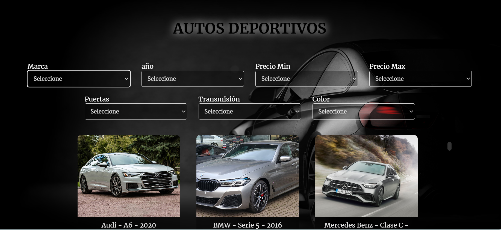

# Car Purchase Filter Page 🚗

## Description

This repository contains the code for a web page that helps users filter and find cars for purchase based on various criteria such as year, make, price, doors, transmission, and color. The project leverages HTML, CSS, and JavaScript to provide a dynamic and interactive user experience with smooth animations.

## Features

- **Advanced Filtering**: Users can filter cars by year, make, price, number of doors, transmission type, and color.
- **Smooth Animations**: Utilizes CSS animations to enhance the user experience.
- **Real-time Updates**: Filters update results in real-time without needing to reload the page.
- **User-friendly Interface**: Clean and intuitive design for easy navigation and use.
- **Responsive Design**: Optimized for various screen sizes, ensuring a seamless experience on both desktop and mobile devices.
